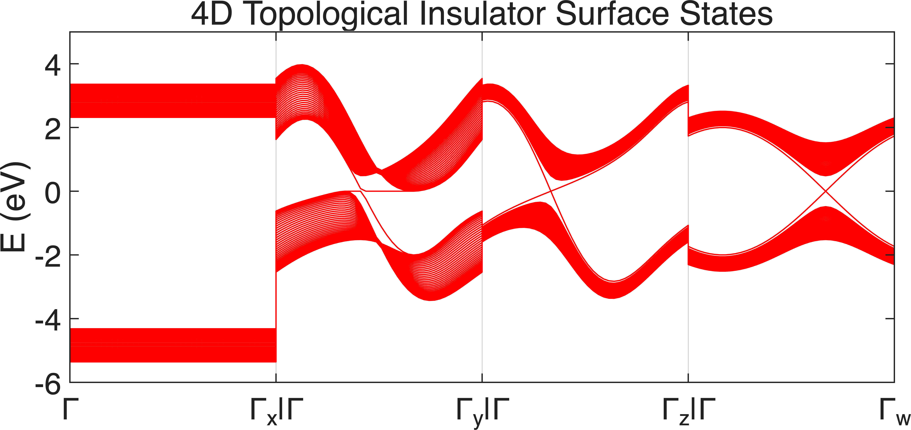
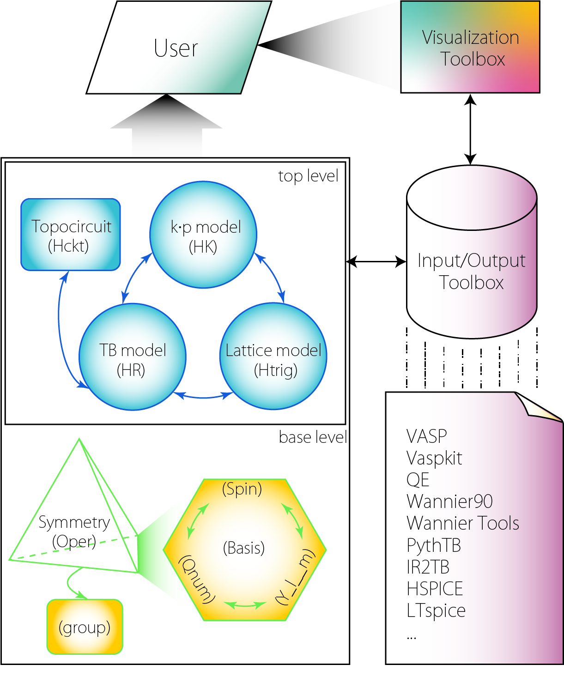

# TBkit: Tight-Binding Toolkit for Quantum Materials


## Introduction
TBkit is a **MATLAB-based computational framework** developed by BUAA-TCMP for first-principles result analysis, tight-binding (TB) model construction, and low-energy effective k·p model development. Designed for researchers in topological materials, magnetic materials, and quantum transport.


## Why **TBkit**?
 It stands out due to the following key features:
### 🌐 Unified Framework with Multiple Interfaces

TBkit is built around a modular and extensible architecture:

- **Core in `MATLAB`** — built on MATLAB’s mature ecosystem, combining **robust symbolic and numerical computation**, **rich documentation**, and **reliable code execution**
- **Flexible Interfaces** — Compatibility with external DFT tools (e.g., `VASP`, `Wannier90`),The modular architecture allows users to seamlessly combine first-principles data, tight-binding models, and analytic tools.

This architecture allows researchers to transition smoothly from ab initio results to model analysis and visualization — all within one coherent and customizable framework.

### 🔧 **Comprehensive Model Control and Conversion**
TBkit offers fine-grained control over tight-binding models—from constructing Hamiltonians with various symmetries and basis choices, to transforming between real-space (`HR`), k-space (`Htrig`) representations and kp mode(`HK`). It supports **model editing**, **dimensional reduction**, **symmetry reduction**, **Wannier fitting**, all within a unified framework.

### 📊 **Visualization and Solution  **

Built-in support for calculating and plotting band structures, density of states, Berry curvature, and more. Model validity and physical properties can be visualized and  solved efficiently.


### ⚙️ **Applications Across Diverse Systems**
Topological Materials, 4D, Fractal, quasicrystal model and Moiré systems ...

### 🧰 Rich Functionality — A Toolbox, Not a Black Box

TBkit is built as a **true toolbox**, not a sealed black box. Like assembling LEGO blocks, users can flexibly combine, modify, and extend components to suit specific research needs.

All core functions are **well-documented** and **fully accessible**, making it easy to:

- Learn from examples and build understanding step by step  
- Tailor workflows for new materials or custom Hamiltonians  
- Inspect, debug, and validate each stage of the modeling process

This design makes TBkit ideal for both **educational purposes** and **advanced research prototyping**.

## Installation
Run the installation script in MATLAB:  
```matlab
run('INSTALL.m');
```


## Usage
Interact with TBkit through:  
- **Command-line** operations
- Custom MATLAB **scripts**
- MATLAB **Live Scripts** (**Highly recommended** for interactive workflows, especially in **MATLAB R2025a** and later)
- Interactive GUI components (future development)

### Example workflow:  
```matlab
%% TBkit Example: 4D Topological Insulator Surface States
% Constructs a 4D topological model and computes surface states
% Reference: 10.1093/nsr/nwaa065

% Define gamma matrices using Pauli matrices
useful_matrices(["sigma","tau"]);
gamma_0 = tau_0 * sigma_0;
gamma_1 = tau_x * sigma_x;
gamma_2 = tau_y * sigma_x;
gamma_3 = tau_z * sigma_x;
gamma_4 = tau_0 * sigma_y;
gamma_5 = tau_0 * sigma_z;

% Build Hamiltonian in trigonometric form
syms epsilon t m k_x k_y k_z k_w real;
f0k = epsilon - t*cos(k_y + k_z)  ;
f1k = -t*(1 + cos(k_x) + cos(k_y));
f2k =  t*(sin(k_x) + sin(k_y))    ;   
f3k = -t*(1 + cos(k_z) + cos(k_w)); 
f4k =  t*(sin(k_z) + sin(k_w))    ;
f5k =       m - t*cos(k_y + k_z)  ;

H_4D = Htrig(4, 'Dim', 4) ...      % 4-band system in 4D space
   +  Trig(f0k,gamma_0)...
   +  Trig(f1k,gamma_1)...
   +  Trig(f2k,gamma_2)...
   +  Trig(f3k,gamma_3)...
   +  Trig(f4k,gamma_4)...
   +  Trig(f5k,gamma_5);

% Generate k-path through Brillouin zone
kpath =   [0 0 0 0;1 0 0 0; ... 
     0 0 1/3 -1/3; 0 1 1/3 -1/3; ...
     0 5/12 0 -1/3; 0 5/12 1 -1/3; ...
     0 5/12 1/3 0; 0 5/12 1/3 1];
[H_4D.klist_cart,H_4D.klist_frac,klist_l,kpoints_l,~] = TBkit.kpathgen(kpath, 40, H_4D.Gk, 'Dim', 4);
kpoints_name = ["\Gamma","\Gamma_x|\Gamma","\Gamma_y|\Gamma","\Gamma_z|\Gamma","\Gamma_w"];

% Convert to real-space representation
H_4D.Rm = eye(4);H_4D.orbL = zeros(4);
H_hr = H_4D.Htrig2HR();            % Fourier transform to real space

% para
t = 1;m = 0;epsilon = 0;
H_4D_n = H_hr.Subsall();

% Create slab geometry (open boundary along x)
H_slab = H_4D_n.supercell_hr(diag([40,1,1,1]), 'OBC', [1 0 0 0]);

% Compute and plot surface band structure
bandplot(H_slab.EIGENCAR_gen(), [-6,5], klist_l,kpoints_l,kpoints_name,'Color','r','title', '4D Topological Insulator Surface States');
```
<p align="center">
  
  <br>
  <em>Figure: 4D model Results in TBkit</em>
</p>

---

##  Program Architecture

TBkit is organized in a ** modular architecture**, offering flexibility, transparency, and extensibility at each level:

<p align="center">
  
</p>

###  User 
- The user interacts with all model components through scripts, functions, or visualization tools.

###  Top-Level Model Layer
This layer includes different **Hamiltonian representations**, which can be constructed, converted, and analyzed interchangeably:

- **TB model (HR)** — real-space tight-binding Hamiltonian
- **Lattice model (Htrig)** — momentum-space tight-binding Hamiltonian
- **k·p model (HK)** —  kp Hamiltonian
- **Topocircuit model (Hckt)** — circuit-mapped version for topolectrical simulation

These models can be converted between each other with full support for symmetry and basis tracking.

###  Base-Level Structure Layer
This layer defines the **internal structure and symmetries** underlying the physical models:

- **Symmetry operations (`Oper`)** — group-theory-based operations derived from symmetry groups  
- **Quantum labels (Spin, Qnum, Basis, Orbital)** — detailed tagging and manipulation of Hilbert space structure

These building blocks ensure that models are constructed **with physical and mathematical consistency**.

### I/O and External Interface
- **Input/Output Toolbox** provides standardized access to files and data formats from:
  - `VASP`, `Wannier90`, `QE`, `Vaspkit`, `WannierTools`, `PythTB`, `IR2TB`, etc.
- Export to hardware simulation tools such as `HSPICE`, `LTspice` is also supported.
- All components integrate seamlessly with the **Visualization Toolbox** for band structures, density of states, Berry curvature, and more.
---

## Development Roadmap
### Short-Term Goals (Active Development)
- [ ] Implement `Clifford` class for Hamiltonian decomposition  
- [ ] Enhance symmetry analysis in `HR`, `Htrig`, `HK` classes  
- [ ] Vectorize symmetry operations in `Htrig`/`HK`  
- [ ] Heterostructure modeling tools  
- [ ] Irreducible Brillouin Zone (IBZ) tools  

### Long-Term Goals
- [ ] Field integration (strain, defects, scattering potentials)  
- [ ] `Oper` class for character table construction  
- [ ] Crystal Electric Field Hamiltonian (HCEF) generator  
- [ ] Machine learning pipelines for DFT band fitting  
- [ ] Plane-wave method development with VASP/WAVECAR interface  
- [ ] Neural network integration for topological classification  
- [ ] Symmetry-aware spin model builder for exact diagonalization  

---


### 📬 Contact & Support

Have questions, suggestions, or feedback?

- Feel free to [open an issue](https://github.com/BUAA-TCMP/TBkit/issues) on GitHub  
- Or contact the developers directly via email:

  - parkstory@outlook.com  
  - fanyang_tcmp@buaa.edu.cn  
  - yzpeng@buaa.edu.cn  
  - p_zhang@buaa.edu.cn
  - You_YiQun@buaa.edu.cn
  - xlsheng@buaa.edu.cn


<!-- # TBkit

parkman@buaa.edu.cn

fanyang_tcmp@buaa.edu.cn

yzpeng@buaa.edu.cn

You_YiQun@buaa.edu.cn -->


<!-- #### 介绍
TBkit是 BUAA-TCMP 推出的基于 matlab 的第一性原理计算结果分析处理，紧束缚模型与低能有效kp模型的构建，调控与计算。为拓扑材料，磁性材料以及量子输运相关科研工作者提供稳定快速、简易高效的程序开发框架
无论是个人、团队、或是高校，都能够用 TBkit实...。

如有什么问题可以挂issue或直接发邮箱；欢迎您的建议

#### 软件架构
外部程序：spglib
matlab工具箱：
TBkit基本函数，TBkit类，HR类，HK类，Htrig类


#### 安装教程
运行INSTALL.m脚本

run the INSTALL.m script

#### 使用说明

直接使用；编写脚本或命令行使用

#### 短期目标
- [ ] Clifford 类的建立 一般性地对哈密顿量进行Clifford拆分
- [ ] 强化 HR Htrig HK 对称性分析功能
- [ ] 向量化 对称性 Htrig HK
- [ ] 异质结
- [ ] Hckt针对一般TB(带复数)的转化 与实验数据的对接
- [ ] IBZ

#### 发展目标

- [ ] TB 模型中各种场的加入，拉伸以及缺陷，散射！
- [ ] Oper Class 的特征标构建 （waiting）
- [ ] HCEF的构建 
- [ ] 构建 各类的 机器学习拟合DFT能带的程序 （2021.07.08-07.12）完成80%
- [ ] （待选）学习牛派的半经典方法，后续接入VASP的WAVECAR读取，先做个平面波的方法，再做个VASP的借口
- [ ] （待选）神经网络的matlab实现，对接DFT或拓扑以及拓扑量子化学 （）
- [ ] （待选）自旋模型的对称性构建，自动生成 简单ED模型求解基本强关联特性


 -->
